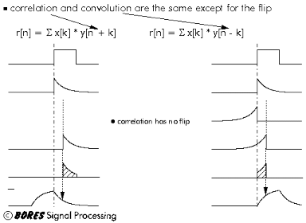
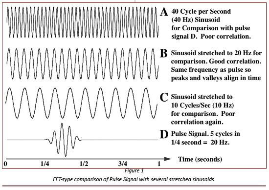
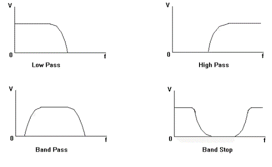

## Bio-Medical Signal Processing Toolkit
 
It is concerned with the representation of signals by a sequence of numbers or symbols and the processing of these signals. Digital signal processing and analog signal processing are subfields of signal processing. DSP includes subfields like: audio and speech signal processing, sonar and radar signal processing, sensor array processing, spectral estimation, statistical signal processing, digital image processing, signal processing for communications, control of systems, biomedical signal processing, seismic data processing, etc. 

The goal of DSP is usually to measure, filter and/or compress continuous real-world analog signals. The first step is usually to convert the signal from an analog to a digital form, by sampling it using an analog-to-digital converter (ADC), which turns analog signal into a stream of numbers. However, often, the required output signal is another analog output signal, which requires a digital-to-analog converter (DAC). Even if this process is more complex than analog processing and has a discrete value range, the application of computational power to digital signal processing allows for many advantages over analog processing in many applications, such as error detection and correction in transmission as well as data compression. 

### <u>Statistical Parameters</u> 

To calculate the statistical parameters of any function or signal, first of all we need to acquire the signal. Here, we have generated a sine wave using the signal generator VI. The sine wave generated can be written as:
f(<em>x</em>) = sin(80π<em>x</em>) 
 
The minimum and maximum values  of the function are 1  and  -1 respectively. 
The mean of this signal over the time interval of 0.01 second is zero as the average value of sine wave over one complete cycle is zero. Hence, the average  value over four cycles has to be zero. 
The rms value of a sine wave is given by peak/√2. The peak value of the signal acquired  here is  . hence the rms value must be one divided by square  root of 2 which  is 0.707. 
Since all the values ranging from -1 to 1 are present in the sine wave in one cycle, so the central value must be equal to  zero. 
Since a sine wave is symmetric in full cycle,  the skewness is zero. It  can also be observed that third moment of the sine wave is equal to zero in a full cycle and hence the skewness  is equal to zero. 
The fourth moment  of the given function about the mean is equal  to 0.375. 
Hence, the kurtosis is given by fourth moment divided by square of variance which is equal to  1.5.  
<strong>Note</strong>: There is a slight difference between the values obtained by mathematical calculation and those  obtained by LabVIEW. This is because LabVIEW calculates the statistical parameters by taking  discrete points  in the signal, while mathematical calculation are done using equations  of waveforms generated which are continuous in nature. 

### <u>Sampling & Aliasing</u> 
While sampling of a data, the problem of aliasing can occur if the Nyquist-Shanon criterion  is not fulfilled. In other words, if the sampling frequency  is not more than or equal to twice of the  signal frequency, the problem of aliasing may occur. 
<em>Aliasing</em> 
Consider for example: the signal frequency  is 15 Hz while the sampling  frequency is 20 Hz. Hence  the ration of sampling  to signal frequencies becomes  1.333. The problem of aliasing  occurs which is shown by the fourier  transform of original signal and that of the sampled  signal, which don’t overlap 
<em>Non-Aliasing</em>  
Consider for example: the signal frequency  is 10 Hz while the sampling  frequency is 50 Hz which  makes the ratio of sampling to signal  frequency equal to 5. Hence,  the problem of aliasing doesn’t occur, which is shown by the  overlap of fourier transform  of the original  signal and that of the sampled  signal. 

### <u>Convolution & Correlation</u> 
Consider for example: the signal frequency  is 10 Hz while the sampling  frequency is 50 Hz which  makes the ratio of sampling to signal  frequency equal to 5. Hence,  the problem of aliasing doesn’t occur, which is shown by the  overlap of fourier transform  of the original  signal and that of the sampled  signal. 
f(t) = 5 sin (10πt)    0 ≤ t ≤ 1
g(t) = sin  (10πt)      0  ≤ t ≤ 1
To perform convolution, we reverse the signal g(t) and replace the variable t by 𝜏 and shift the function g(𝜏) by t.
Thus, the convolution of f and g is written as:

The limits of integration will have four cases:
 1. t &lt; 0 
  in this case, the two signals don’t overlap and hence the result of convolution is zero. 
  2. 0 ≤ t ≤ 1 
  in this case, the two signals overlap and the limits of integration vary from 0 to t. 
  3. 1 ≤ t ≤ 2 
  in this case, the two signals overlap and the limits of integration vary from t-1 to 1. 
  4. t &gt; 2 
 in this case, the two signals don’t overlap and hence the result of convolution is zero. Now, taking the two integrals and putting the limits according to the above discussion, we get: (f*g)(t) = 0 at t=0 (f*g)(t) = 1.25 at t= 1.5 s (f*g)(t) = -2.5 at t= 1 s (f*g)(t) = 1.25 at t= 1.5 s (f*g)(t) = 0 at t = 2 s . 
 

### <u>Power Spectrum</u> 
For a given  signal, the power spectrum gives  a plot of the portion of a signal's power (energy per  unit time) falling within given  frequency bins. The most common  way  of generating a power  spectrum is by using a discrete Fourier transform, but other  techniques such as the  maximum  entropy method can also be used.
 

### <u>HISTOGRAM</u> 
Histograms are used to  plot density of data, and  often for density estimation: estimating the  probability density function of the  underlying variable. The total area  of a histogram used for probability  density is always normalized  to 1. If the length of the intervals on the <em>x</em>-axis  are all 1, then a histogram is identical  to a relative frequency plot.
 

### <u>Fast Fourier Transform:</u> 
Since the fourier transform gives the information about the frequency  component of any signal, it is used for finding  out what are the frequencies present in the signal if the signal is stationary i.e. the frequency component of the signal is not changing with time.
 

### <u>Discrete cosine transform</u> 
A <strong>discrete  cosine transform </strong>(<strong>DCT</strong>) expresses a sequence of finitely  many data points in terms of  a sum of cosine functions oscillating  at different frequencies. DCTs are important  to  numerous applications  in science and engineering, from lossy compression of audio and images (where small high-frequency  components can be discarded), to spectral methods for the numerical solution of  partial  differential equations. The use of cosine rather than sine functions is critical in these  applications: for compression, it turns out that  cosine functions are much more efficient  (as explained below, fewer  are  needed to approximate a typical signal), whereas for differential equations the cosines express  a particular choice of boundary conditions.
 

### <u>Hilbert transform</u> 
In mathematics and in signal processing, the Hilbert transform is a linear operator which takes a function, u(t), and produces a function, H(u)(t), with the same domain. The Hilbert transform is named after David Hilbert, who first introduced the operator in order to solve a special case of the Riemann–Hilbert problem for holomorphic functions. It is a basic tool in  Fourier analysis, and provides a concrete means for realizing the conjugate of a given function or Fourier series. Furthermore, in harmonic analysis, it is an example of a singular  integral operator, and of a Fourier multiplier. The Hilbert transform is also important in the field of signal processing where it is used to derive the analytic representation of a signal u(t).
The Hilbert transform was originally defined for periodic functions, or equivalently for functions on the circle, in which case it is given by convolution with the Hilbert kernel. More commonly, however, the Hilbert transform refers to a convolution with the Cauchy  kernel, for functions defined on the real line R (the boundary of the upper half-plane). The Hilbert transform is closely related to the Paley–Wiener theorem, another result relating holomorphic functions in the upper half-plane and Fourier transforms of functions on the real line.
 

### <u>WAVELET TRANSFORM</u> 
In numerical analysis and functional analysis, a discrete wavelet transform (DWT) is any  wavelet transform for which the wavelets are discretely sampled. As with other wavelet transforms, a key advantage it has over Fourier transforms is temporal resolution: it captures both frequency and location information (location in time).

IIR FILTERS
Infinite impulse response (IIR) is a property of signal processing systems. Systems with this property are known as IIR systems or, when dealing with filter systems, as IIR filters. IIR systems have an impulse response function that is non-zero over an infinite length of time. 
This is in contrast to finite impulse response (FIR) filters, which have fixed-duration impulse responses. The simplest analog IIR filter is an RC filter made up of a single resistor (R) feeding into a node shared with a single capacitor (C). This filter has an exponential impulse response characterized by an RC time constant.
IIR filters may be implemented as either analog or digital filters. In digital IIR filters, the output feedback is immediately apparent in the equations defining the output. Note that unlike FIR filters, in designing IIR filters it is necessary to carefully consider the "time zero" case in which the outputs of the filter have not yet been clearly defined. 

FIR FILTER
A low-pass filter is a filter that passes low-frequency signals but attenuates (reduces the  amplitude of) signals with frequencies higher than the cut-off frequency. The actual amount of attenuation for each frequency varies from filter to filter. It is sometimes called a high-cut filter, or treble cut filter when used in audio applications. A low-pass filter is the opposite of a high-pass filter, and a band-pass filter is a combination of a low-pass and a high-pass. 

HIGH PASS FILTER
A high-pass filter, or HPF, is an LTI filter that passes high frequencies well but attenuates (i.e., reduces the amplitude of) frequencies lower than the filter's cut-off frequency. The actual amount of attenuation for each frequency is a design parameter of the filter. It is sometimes called a low-cut filter or bass-cut filter. 

BAND PASS FILTER
In signal processing, a band-stop filter or band-rejection filter is a filter that passes most frequencies unaltered, but attenuates those in a specific range to very low levels. It is the opposite of a band-  pass filter. 
 

### <u>Median Filter</u> 
In signal processing, it is often desirable to be able to perform some kind of noise reduction on an image or signal. The median filter is a nonlinear digital filtering technique, often used to remove  noise. Such noise reduction is a typical pre-processing step to improve the results of later processing (for example, edge detection on an image). Median filtering is very widely used in digital image  processing because under certain conditions, it preserves edges while removing noise.
Consider an input sine wave of frequency 30 Hz and amplitude 5V is given to a median filter. The filtered output comes out to be a modified sine wave whose peak has been clipped. Thus, the median filter removes the sharp peak of the signal making it a smooth signal. 

### <u>Data Compression</u> 
Consider for example: An input sine wave of frequency 30 Hz and amplitude 5V is given to a median filter. Let the reduction factor be 25. This means at a time, 25 data points are taken and the average is taken. Again, this point is plotted and the next 25 data points are considered and the average is taken. This process goes on repeating itself to get the compressed data. 
The value -1.00978 specifies the instantaneous mean of the current reduction factor size. 

